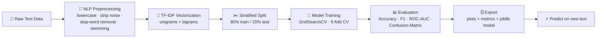

<div align="center">

# 🎯 SAM AI Tech Task

### Machine Learning Internship Projects — SAM AI Technologies

**NLP-powered solutions** · **Tuned + cross-validated models** · **Evaluated with Accuracy, F1, ROC-AUC & ROUGE** · **100% reproducible**

</div>

---

## 📖 Overview

This repository contains one self-contained, production-grade project per
assigned task. Every project follows a **complete ML lifecycle** — from raw
text to a tuned, evaluated, and exported model — so each one stands on its own
as a strong submission.

## 🧭 Common Architecture

All classification tasks share the same battle-tested pipeline:



## 📋 Task List

| # | Task | Project | Key Models | Best F1 |
|---|------|---------|-----------|---------|
| 1 | **Fake News Detection** — classify news articles as REAL or FAKE | [`Task-1-Fake-News-Detection/`](Task-1-Fake-News-Detection/) | Naive Bayes · Logistic Regression · Ensemble | **0.934** |
| 2 | **Email Spam Classifier** — detect spam and show the predicted category | [`Task-2-Email-Spam-Classifier/`](Task-2-Email-Spam-Classifier/) | Naive Bayes · SVM · Ensemble | **0.952** |
| 3 | **Text Summarization** — extractive summaries from long articles | [`Task-3-Text-Summarization/`](Task-3-Text-Summarization/) | Frequency · TF-IDF · TextRank | ROUGE-1 **0.30** |

> Each task folder contains its own README with a **pipeline flowchart** and
> **result screenshots** — open the links above for the full walkthrough.

## 🛠 Tech Stack

| Library | Purpose |
|---------|---------|
| **Python 3.11** | Core language |
| **scikit-learn** | TF-IDF, Naive Bayes, Logistic Regression, SVM, GridSearchCV, voting ensembles |
| **NLTK** | Porter stemming for text preprocessing |
| **pandas** | Data loading & manipulation |
| **matplotlib** | Confusion matrices, ROC curves, feature & method-comparison charts |
| **joblib** | Model + vectorizer export for reuse |

## 🚀 Quick Start

Each project is fully independent. From any task folder:

```bash
pip install -r requirements.txt
python <task_script>.py            # run the full pipeline
python <task_script>.py --predict "text to classify"   # single prediction
```

| Task | Folder | Script |
|------|--------|--------|
| 1 | `Task-1-Fake-News-Detection/` | `fake_news_detection.py` |
| 2 | `Task-2-Email-Spam-Classifier/` | `email_spam_classifier.py` |
| 3 | `Task-3-Text-Summarization/` | `text_summarization.py` |

## 📁 Repository Structure

```
SAM-AI-Tech-Task/
├── README.md                                  ← you are here
│
├── Task-1-Fake-News-Detection/
│   ├── fake_news_detection.py                 # full pipeline script
│   ├── README.md                              # flowchart + results
│   ├── requirements.txt
│   ├── data/news.csv                          # fake_or_real_news dataset
│   └── output/                                # plots, metrics, saved model
│
├── Task-2-Email-Spam-Classifier/
│   ├── email_spam_classifier.py
│   ├── README.md
│   ├── requirements.txt
│   ├── data/spam.csv                          # SMS Spam Collection
│   └── output/                                # plots, metrics, saved model
│
└── Task-3-Text-Summarization/
    ├── text_summarization.py
    ├── README.md
    ├── requirements.txt
    ├── sample_articles/                       # article + gold reference
    └── output/                                # method-comparison chart
```

## ✅ What Makes These Projects Stand Out

- **Hyperparameter tuning** — every model is tuned with `GridSearchCV`
  (5-fold cross-validation), never used with default parameters blindly.
- **Complete evaluation** — Accuracy, Precision, Recall, **F1-Score** and
  **ROC-AUC** reported for every model, plus confusion matrices.
- **Visual evidence** — ROC curves, confusion matrices and feature-importance
  charts are saved to `output/` and embedded in each README.
- **Ensemble models** — soft-voting ensembles combine the tuned classifiers
  for a final, more robust predictor.
- **Real datasets** — the public *fake_or_real_news* and *SMS Spam Collection*
  datasets are bundled, so everything runs offline and reproducibly.
- **Reusable artifacts** — trained models and vectorizers are exported as
  `.joblib` files, ready to serve predictions.

## 📌 Submission

**Repo:** https://github.com/rishabhverma007/SAM-AI-Tech-Task

— **Rishabh Verma** · SAM AI Technologies Internship