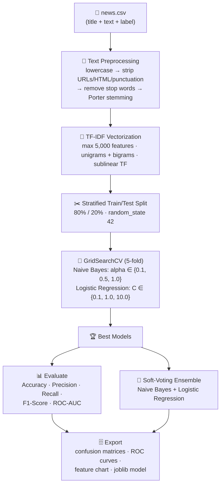
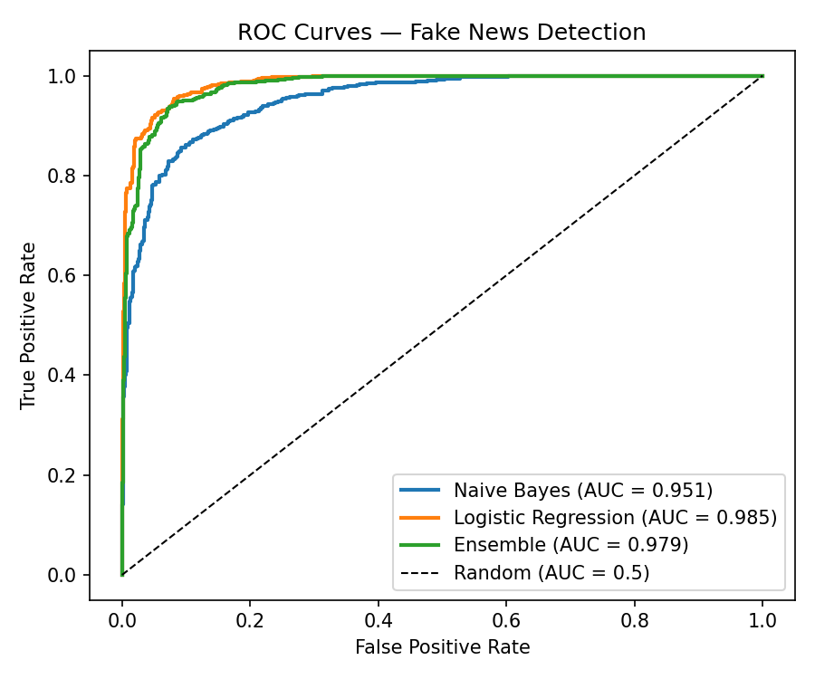
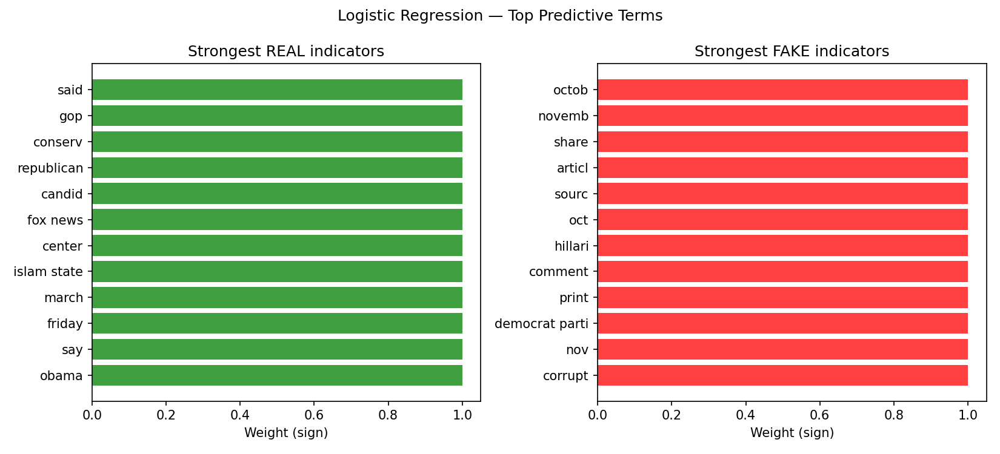

# 📰 Task 1 — Fake News Detection

Classify news articles as **REAL** or **FAKE** using NLP and a tuned,
cross-validated machine learning pipeline.

## ✅ Task Requirements (from the task sheet)

- [x] Build a model to classify news articles as Real or Fake.
- [x] Preprocess text using NLP techniques.
- [x] Convert text into numerical features using TF-IDF.
- [x] Train classification models such as Naive Bayes or Logistic Regression.
- [x] Evaluate the model using Accuracy and F1-Score.

## 🧠 Pipeline Flowchart



## 📊 Results (80/20 stratified split)

| Model | Best Params | 5-fold CV F1 | Accuracy | Precision | Recall | **F1** | ROC-AUC |
|-------|-------------|:---:|:---:|:---:|:---:|:---:|:---:|
| Naive Bayes | `alpha=0.5` | 0.8709 | 0.8785 | 0.9196 | 0.8297 | **0.8723** | 0.9511 |
| **Logistic Regression** | `C=10.0` | 0.9293 | 0.9345 | 0.9408 | 0.9274 | **0.9341** | 0.9854 |
| Ensemble (NB + LR) | — | — | 0.9250 | — | — | **0.9241** | 0.9793 |

> **Best single model: Logistic Regression** — 93.4% F1 and 98.5% ROC-AUC.

### Confusion Matrices

| Naive Bayes | Logistic Regression |
|-------------|---------------------|
|  |  |

### ROC Curves



### What the Model Learned

The chart below shows the terms with the strongest predictive weight —
the *real* news indicators vs. the *fake* news indicators learned by the
Logistic Regression model:



## 🔍 How Each Step Works

1. **Text preprocessing (NLP)** — the article title and body are lowercased,
   URLs/HTML/punctuation are stripped, common stop words (`the`, `and`, `is`…)
   are removed, and every word is reduced to its root with a **Porter stemmer**
   (`running → run`). This focuses the model on meaningful content words.

2. **TF-IDF vectorization** — each article becomes a 5,000-dimensional numeric
   vector. **TF-IDF** weights words by how often they appear in the article
   (**TF**) and how rare they are across all articles (**IDF**), so generic
   words carry less weight than distinctive ones. Unigrams *and* bigrams are
   used so phrases like *"breaking news"* are captured.

3. **Model training** — both classifiers are tuned with **GridSearchCV**
   (5-fold cross-validation, scoring = F1) to find the best hyperparameters
   instead of relying on defaults:
   - **Naive Bayes** — fast, probabilistic model based on Bayes' theorem.
   - **Logistic Regression** — linear model with strong text-classification
     performance and interpretable coefficients.

4. **Evaluation** — the tuned models are scored on an untouched 20% hold-out
   set using **Accuracy**, **F1-Score** (the sheet's required metrics), plus
   Precision, Recall and **ROC-AUC** for a fuller picture.

5. **Ensemble + export** — a soft-voting ensemble combines both models for
   robustness; the final model, vectorizer, metrics and all plots are saved
   to `output/` for reuse.

## 🚀 How to Run

```bash
pip install -r requirements.txt

python fake_news_detection.py                              # full pipeline
python fake_news_detection.py --test-size 0.3              # custom split
python fake_news_detection.py --predict "Your headline here"   # classify one article
```

## 📁 Project Structure

```
Task-1-Fake-News-Detection/
├── fake_news_detection.py      # main pipeline script
├── requirements.txt
├── README.md
├── data/
│   └── news.csv                # fake_or_real_news dataset (6,335 articles)
└── output/                     # generated: plots, results.json, models
```

## 📚 Dataset

`data/news.csv` is the public **fake_or_real_news** dataset — 6,335 labelled
news articles (`REAL` / `FAKE`) with title, text and label columns.