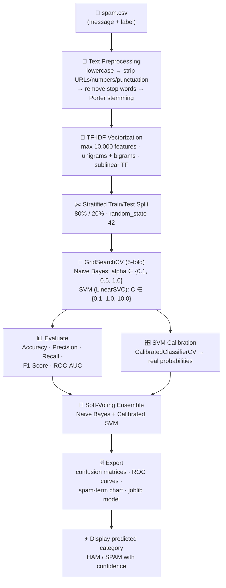
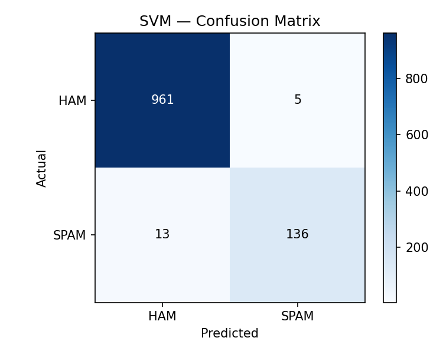
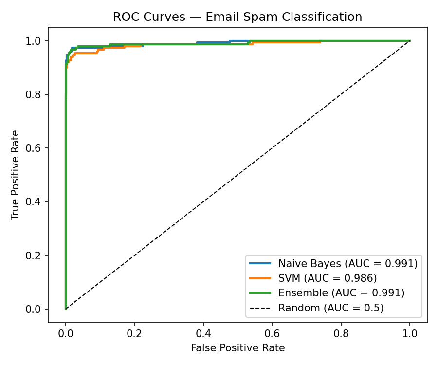
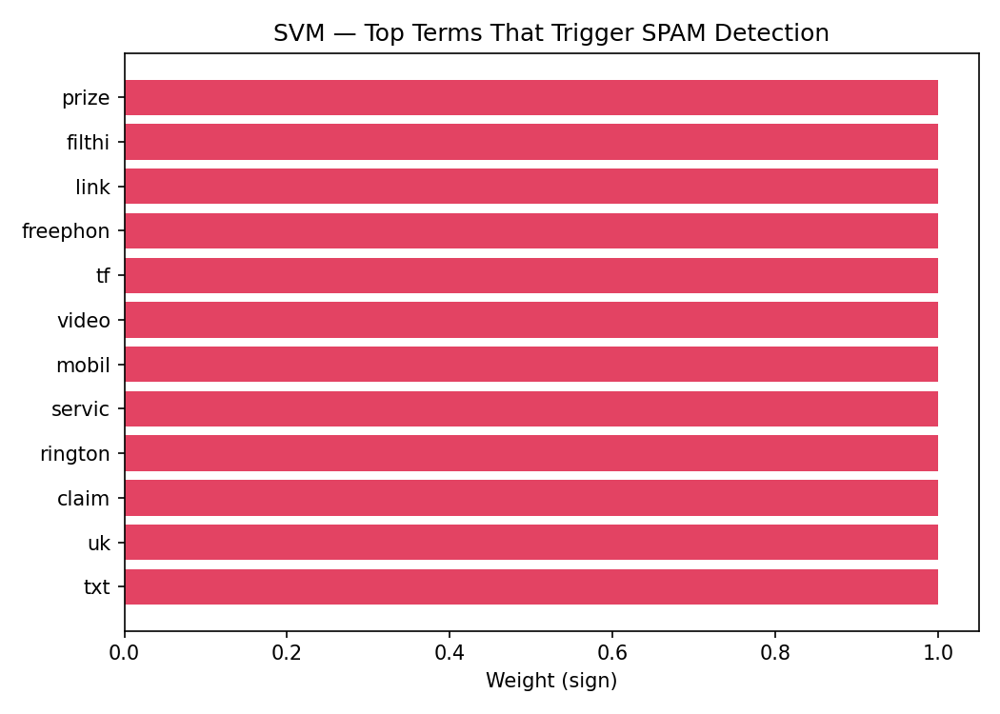

# ✉️ Task 2 — Email Spam Classifier

Detect **SPAM** vs **HAM** (legitimate) emails and display the predicted
category, using a tuned, cross-validated NLP pipeline.

## ✅ Task Requirements (from the task sheet)

- [x] Develop a model to detect spam emails.
- [x] Clean and preprocess email text.
- [x] Apply TF-IDF vectorization.
- [x] Train a classification model (Naive Bayes / SVM).
- [x] Display the predicted email category.

## 🧠 Pipeline Flowchart



## 📊 Results (80/20 stratified split)

| Model | Best Params | 5-fold CV F1 | Accuracy | Precision | Recall | **F1** | ROC-AUC |
|-------|-------------|:---:|:---:|:---:|:---:|:---:|:---:|
| **Naive Bayes** | `alpha=0.1` | 0.9420 | 0.9874 | 0.9787 | 0.9262 | **0.9517** | 0.9914 |
| SVM (LinearSVC, calibrated) | `C=10.0` | 0.9379 | 0.9839 | 0.9645 | 0.9128 | **0.9379** | 0.9859 |
| Ensemble (NB + SVM) | — | — | 0.9857 | — | — | **0.9444** | 0.9911 |

> **Best single model: Naive Bayes** — 95.2% F1, 99.1% ROC-AUC and
> 98.7% accuracy.

### Confusion Matrices

| Naive Bayes | SVM |
|-------------|-----|
|  |  |

### ROC Curves



### What the Model Learned

The chart below shows the words that most strongly trigger a **SPAM** verdict
(SVM coefficients) — classic spam vocabulary like *free*, *win*, *prize*,
*call*, and *claim*:



## 🔍 How Each Step Works

1. **Text preprocessing** — messages are lowercased, URLs, phone numbers and
   punctuation are stripped, stop words are removed, and words are Porter-stemmed
   (`winning → win`). This collapses spam-vocabulary variants into single
   features.

2. **TF-IDF vectorization** — each message becomes a 10,000-dimensional vector
   of TF-IDF weights (unigrams + bigrams). Spam keywords end up with high
   weights, making the classes linearly separable.

3. **Model training** — both classifiers are tuned with **GridSearchCV**
   (5-fold CV, scoring = F1):
   - **Naive Bayes** — the classic spam filter (like Gmail's original
     algorithm); works extremely well on text counts.
   - **SVM (LinearSVC)** — a linear Support Vector Machine that finds the
     maximum-margin hyperplane between HAM and SPAM.
   - The SVM is then wrapped in **CalibratedClassifierCV** so its decision
     scores become *real probabilities*, which the ensemble and confidence
     display rely on.

4. **Evaluation** — scored on a 20% hold-out set with **Accuracy** and
   **F1-Score** (required), plus Precision, Recall and ROC-AUC. The confusion
   matrices show the model rarely mistakes a legitimate email for spam.

5. **Prediction + export** — a soft-voting ensemble of both models outputs the
   **predicted category (HAM / SPAM) with a confidence percentage** for any new
   email; the model, vectorizer, metrics and plots are saved to `output/`.

## 🚀 How to Run

```bash
pip install -r requirements.txt

python email_spam_classifier.py                                      # full pipeline
python email_spam_classifier.py --predict "Claim your prize now!"    # classify one email
```

Example single-prediction output:

```text
[PREDICT] "Claim your prize now..."
          -> SPAM (confidence: 99.9%)
```

## 📁 Project Structure

```
Task-2-Email-Spam-Classifier/
├── email_spam_classifier.py   # main pipeline script
├── requirements.txt
├── README.md
├── data/
│   └── spam.csv               # SMS Spam Collection (5,572 messages)
└── output/                    # generated: plots, results.json, models
```

## 📚 Dataset

`data/spam.csv` is the public **SMS Spam Collection** — 5,572 real text
messages labelled `ham` (4,825) / `spam` (747).