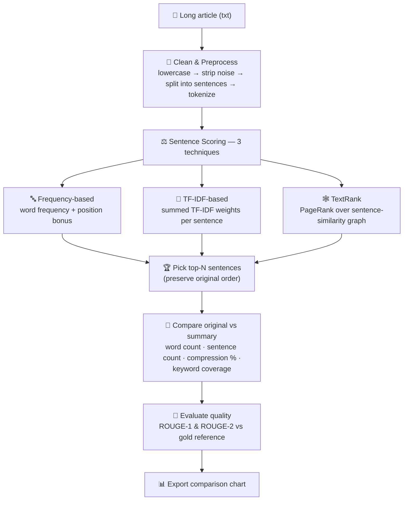
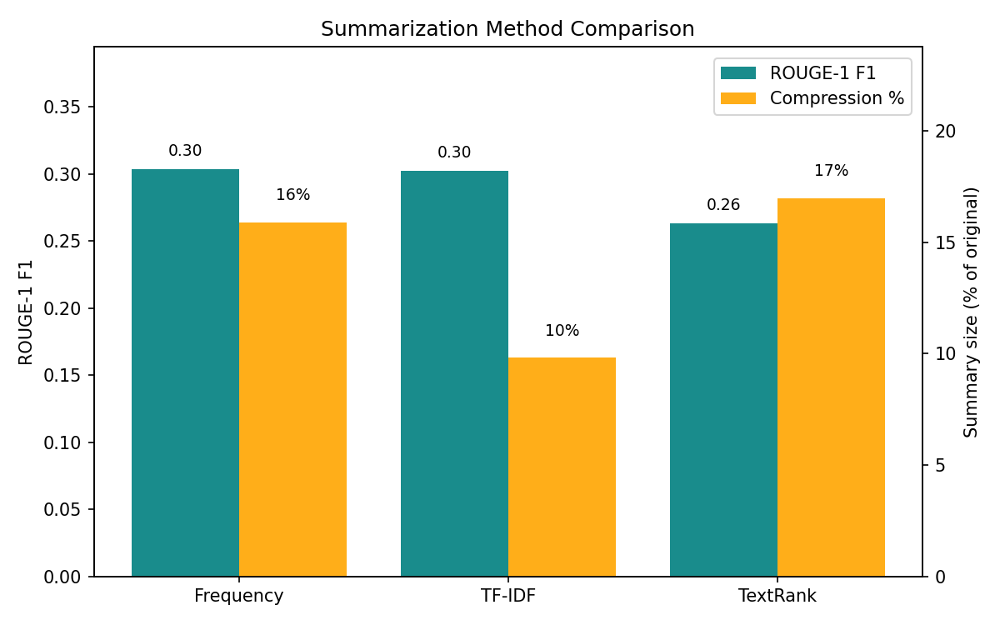

# 📄 Task 3 — Text Summarization

Generate short, meaningful summaries from long articles using **extractive**
text summarization — three different techniques, compared and evaluated.

## ✅ Task Requirements (from the task sheet)

- [x] Build a system to generate summaries from long articles.
- [x] Clean and preprocess text data.
- [x] Apply extractive text summarization techniques.
- [x] Compare original and summarized text.
- [x] Evaluate summary quality.

## 🧠 Pipeline Flowchart



## 📊 Results (sample article: 642 words, 29 sentences → 5-sentence summaries)

| Technique | Summary size | Compression | Top-10 keywords kept | ROUGE-1 F1 | ROUGE-2 F1 |
|-----------|:---:|:---:|:---:|:---:|:---:|
| Frequency-based | 102 words | 15.9% | 9 / 10 | **0.30** | 0.07 |
| TF-IDF-based | 63 words | 9.8% | 5 / 10 | 0.30 | **0.12** |
| TextRank (graph) | 109 words | 17.0% | 9 / 10 | 0.26 | 0.04 |

> **Frequency & TF-IDF** produce the most faithful summaries; **TextRank**
> surfaces the most central ideas via graph connectivity — try all three on
> your own articles.

### Method Comparison Chart



## 🔍 How Each Technique Works

1. **Frequency-based scoring** — every word's frequency is counted across the
   article and normalized. Each sentence is scored by the average frequency of
   its words, with a small **position bonus** for early sentences (key
   information usually appears at the start of an article).

2. **TF-IDF-based scoring** — each sentence is vectorized with TF-IDF and
   scored by its *total* TF-IDF weight, normalized by sentence length so long
   sentences aren't favoured blindly. Sentences containing rare, distinctive
   terms score highest.

3. **TextRank (graph-based)** — each sentence is a node in a graph, with edge
   weights equal to the **Jaccard similarity** between sentences' word sets.
   **PageRank** is run over this graph: sentences that share words with many
   other important sentences accumulate the highest rank — the same idea
   behind Google's original web-ranking algorithm.

The top-N scoring sentences from each method are picked and re-ordered to
preserve the article's natural flow.

## 📐 How the Summary Is Compared & Evaluated

- **Original vs summary** — word counts, sentence counts, **compression
  ratio** (summary size ÷ original size) and **keyword coverage** (how many of
  the article's top-10 words survive into the summary).
- **ROUGE-1 / ROUGE-2** — standard summarization metrics comparing unigram and
  bigram overlap between the generated summary and a **gold reference
  summary** (included in `sample_articles/`), reported as precision, recall and
  F1.
- **Comparison chart** — a bar chart of every method's ROUGE-1 F1 and
  compression, saved to `output/method_comparison.png`.

## 🚀 How to Run

```bash
pip install -r requirements.txt

python text_summarization.py                              # default article
python text_summarization.py --file path/to/article.txt   # any text file
python text_summarization.py --top_n 5                    # summary length
python text_summarization.py --reference ref.txt          # your gold summary
```

## 📁 Project Structure

```
Task-3-Text-Summarization/
├── text_summarization.py        # main script
├── requirements.txt
├── README.md
├── sample_articles/
│   ├── example_article.txt      # 642-word article used in the demo
│   └── example_article_reference_summary.txt  # gold summary for ROUGE
└── output/
    └── method_comparison.png    # generated comparison chart
```